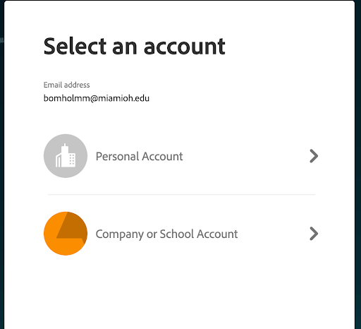

# Adobe

After being assigned a Adobe Creative Cloud license, the user may have to log into Adobe to access the software. When logging in, the user will have to choose "Personal Account" or "Company or School Account" (see image below). They need to use the "Company or School Account" in order to access the software.

<figure><figcaption></figcaption></figure>
